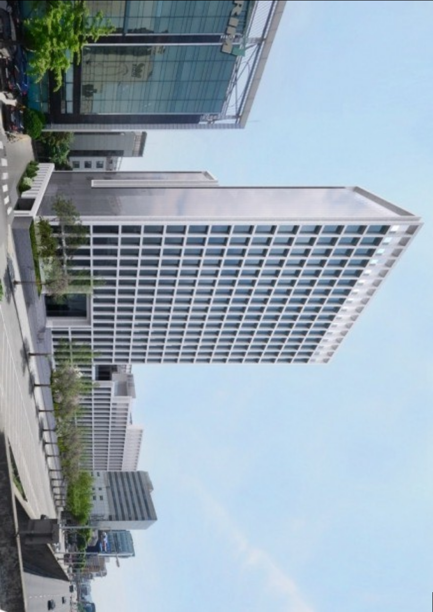
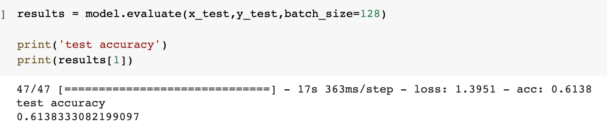

# Computer-Vision

# Assignment

## 주요 과제 결과물

## 1. Harris cornor detection

## 2. Feature Matching - SIFT 알고리즘 적용

- 참고) SIFT 알고리즘은 직접 구현이 아닌 opencv 라이브러리를 사용했습니다.

- 원본 이미지와 레퍼런스의 이미지에서 SIFT 알고리즘을 사용하여 특징점을 추출 후 이를 매칭시켜 변환 행렬을 구한다

- 이때 변환 행렬을 구하는 과정에서 SIFT 알고리즘에서 추출한 특징점 중 Outlier가 섞여 있을 수 있다. 이를 효과적으로 해결 하기 위해 RANSAC을 적용한 것과 안한 것으로 구분

-  RANSAC과 NO RANSAC을 통해 구해진 변환 행렬을 이용해  직접 원본 이미지에 적용해 본다.

결과 이미지

RANSAC 적용

RANSAC 미적용

## 3. ResNet50  : Cifar-100 dataset을 활용한 ResNet50 (Fine Tuning)

### ResNet50 pre-modeing
- 사용할 데이터 : Cifar-100 dataset

### Cifar-100 데이터 준비
- Cifar-100 dataset은 32 x 32 x 3크기의 50,000개 training-set이 있다.
- Cifar-100 dataset은 label은 100개의 class로 나누어져 있다.
- Cifar-100 dataset 훈련,검증,테스트 집합으로 나눈다.
- 기존 데이터에서 일부만 선택해서 사용
train : 192000, validation : 4800, test : 6000개
- labels의 경우 one-hot Encoding 방식을 적용한다.
- ResNet50의 Input size를 맞추기 위해 원본 이미지 크기인 229 x 229 x 3을 224 x 224 x 3으로 resize

### ResNet50 모델생성

- 1.ResNet50을 ImageNet 데이터셋으로 학습시킨 weight와 bias를 사용하여 pre-modeling을 한다.

- 2.ResNet50의 모델을 1에서 구한 ResNet50을 input으로하고 1에서 구한 ResNet50의 average pooling층을 output으로 하는 모델을 새롭게 구성

- 3.Cifar-100 dataset은 class가 100개이므로 FC(Fully-connected)100을 생성
- 4.2에서 구한 모델을 input으로하고 3에서 구한 FC 100를 output으로 하는 새로운 모델을 생성
- 5.Fine-tunning의 방법으로 마지막 FC Layer만 재학습시킨다.

### 모델 성능

