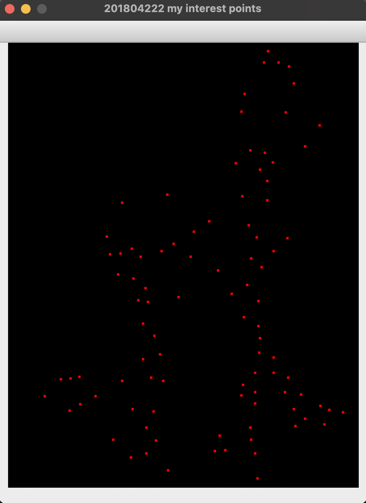

# Computer-Vision

# CNU Assignment

## 주요 과제 결과물

### 1. Harris cornor detection

### 2. Feature Matching - SIFT 알고리즘 적용

- 참고) SIFT 알고리즘은 직접 구현이 아닌 opencv 라이브러리를 사용했습니다.

- 원본 이미지와 레퍼런스의 이미지에서 SIFT 알고리즘을 사용하여 특징점을 추출 후 이를 매칭시켜 변환 행렬을 구한다

- 이때 변환 행렬을 구하는 과정에서 SIFT 알고리즘에서 추출한 특징점 중 Outlier가 섞여 있을 수 있다. 이를 효과적으로 해결 하기 위해 RANSAC을 적용한 것과 안한 것으로 구분

-  RANSAC과 NO RANSAC을 통해 구해진 변환 행렬을 이용해  직접 원본 이미지에 적용해 본다.

결과 이미지

RANSAC 적용

RANSAC 미적용

